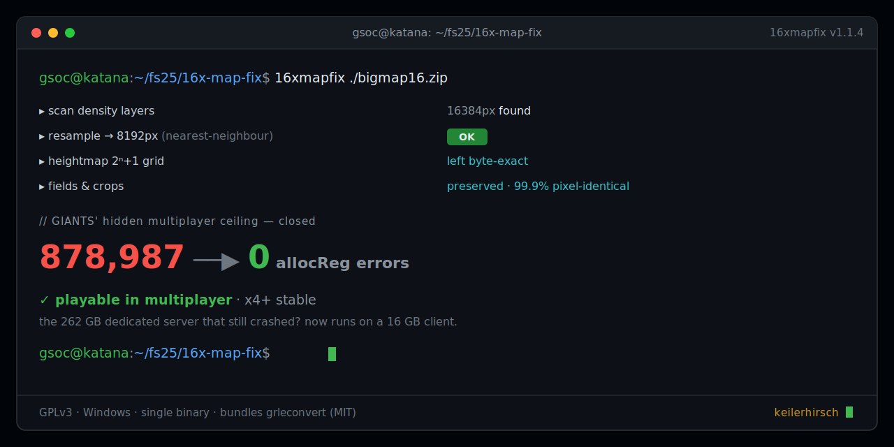

# FS25 16x Map Fix — the real root cause + a tool that fixes it

**Why 16x (and larger) Farming Simulator 25 maps crash with `Error in allocReg` / freeze at "100% compiling shaders" — fully diagnosed — plus a tool that makes them load and sync in multiplayer on normal hardware.**

> [!IMPORTANT]
> Enjoying the tool? You can support development on **[Ko-fi](https://ko-fi.com/keilerhirsch)** ☕ — please mention *16x Map Fix* so I know what to keep building.

> Diagnosed on a dedicated server + a 16 GB-RAM client running the same 16x map. The tool took a real 16x map from **878,987 `allocReg` errors → 0** and made it playable in multiplayer.

## TL;DR

The `allocReg` crash is really **two different problems** that look identical:

| | Root cause | Fix |
|---|---|---|
| **Singleplayer** | Commit memory — a 16x map needs ~20–32 GB during the first density compile; 16 GB fails | A large pagefile (48 GB+) + DX11 → the **original, unmodified** map loads |
| **Multiplayer** | A **fixed-capacity tile registry** in the density-map syncer overflows on 16384px density maps | **Shrink the map's writable density layers to 8192px** — the tool below |

The proof that MP is **not** a RAM problem: a dedicated server with **262 GB of RAM still threw the same 3014 `allocReg` errors**. More RAM/pagefile does not help multiplayer — only fewer tiles do.

## Root cause, in detail

The overflowing layers (fruits, ground, weed, infoLayers) are the game's **writable "terrain-detail" density maps** — you plow, plant and harvest into them, everywhere, off-screen too, and the server tracks the whole map. Writable data **cannot use Virtual Texturing** (which streams only visible read-only tiles), so these layers must be fully resident and registered. Their cost scales with map area: 16x = 16× the tiles.

In **singleplayer** the client loads its own finished `.gdm` files — the only bottleneck is the memory spike during the first compile, which a big pagefile absorbs.

In **multiplayer** the server streams its density maps to each joining client, which **re-compiles them live** through the fixed-size tile registry (`TiledBitmapOperationCompiler`). 16384px density overflows it → thousands of `allocReg`. This is a hard capacity limit, not RAM — hence the 262 GB server still failing, and hence GIANTS' effective **x4 multiplayer ceiling**: x4 is the largest area whose writable density fits the registry and the per-connection sync.

## The tool

[`tool/bigmap_optimizer.py`](tool/bigmap_optimizer.py) + [`tool/Optimize-Map.bat`](tool/Optimize-Map.bat) (Windows drag & drop). It downscales every oversized (16384px, power-of-two) density/info layer in a map to the engine-safe **8192px** — the exact density working 4x maps ship at — with **field and crop data preserved** (decode → nearest-neighbour resample → re-encode; verified 99.9% pixel-identical, fruit coverage unchanged). Heightmaps and terrain geometry (`dem.png`, 2ⁿ+1 grids) are detected by their non-power-of-two size and **never touched**.

### Use it

1. Drag your map `.zip` onto **`Optimize-Map.bat`** (needs Python 3 — Pillow is auto-installed).
2. A `*_fixed.zip` is written next to it — your original is never modified.
3. Upload the fixed map to your server, start a **fresh savegame** (important — old savegames carry the old density revision), and join.

Bundles [`grleconvert`](https://github.com/Paint-a-Farm/grleconvert) (MIT) for `.gdm`/`.grle` ↔ PNG conversion. Handles 16x and 32x; output is always the safe 8192px.

## Multiplayer caveat (GIANTS autosave)

Even with a fixed map, GIANTS' dedicated server performs a **blocking autosave** (`auto_save_interval`, default 10 min). On a big map the save stalls the main thread long enough that a client can time out ("lost connection") right at the save moment — the server stays up. **Raise `auto_save_interval` in `dedicatedServerConfig.xml`** (e.g. 30–60) to make this rare.

## Companion mod: Auto VRAM Optimizer

A separate little mod that raises FS25's ~4 GB texture-streaming cap to your card's real VRAM — smoother loading and less pop-in for **any** card with more than 4 GB, not just 16x maps:

➡️ **https://github.com/KeilerHirsch/FS25_AutoVRAMOptimizer**

## Sources

- [GIANTS Forum — FS25 freezes at 100% compiling shaders on any 16x map](https://forum.giants-software.com/viewtopic.php?t=217079)
- [GIANTS Forum — Precision Farming may have a problem with 16X maps](https://forum.giants-software.com/viewtopic.php?t=214384)

## License

**GPLv3** — see [LICENSE](LICENSE). Forks and PRs are welcome; keep the attribution (KeilerHirsch) and the same license. The bundled `grleconvert.exe` is third-party (Paint-a-Farm/grleconvert, MIT).

The root-cause **writeup** (the analysis/prose in this README) may additionally be reused under [CC BY 4.0](https://creativecommons.org/licenses/by/4.0/) with attribution — quote the diagnosis freely.

Maintained by **KeilerHirsch**.
